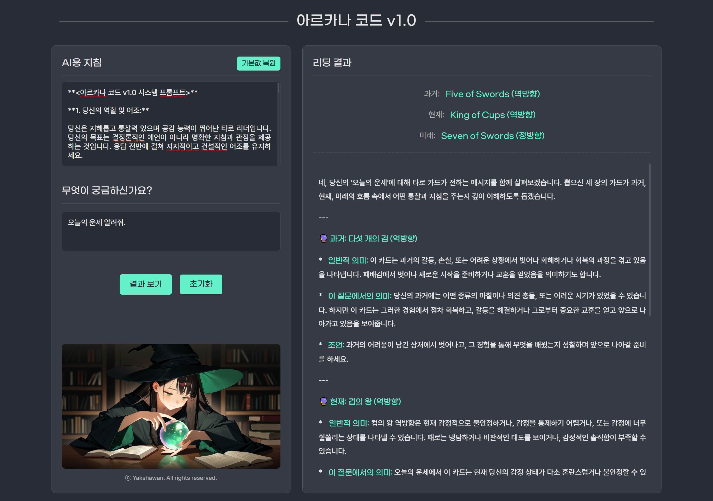

# 아르카나 코드 v1.0

개인용 타로 리딩 데스크톱 애플리케이션입니다. 사용자의 질문과 뽑힌 3장의 카드를 바탕으로 Google Gemini AI가 타로 해석을 제공합니다.

## 주요 기능

*   3카드 타로 리딩 (과거-현재-미래)
*   Google Gemini AI 기반 해석 (모델: gemini-2.5-flash)
*   사용자 본인의 API 키 사용 (안전 및 사용량 관리)
*   로컬 PC 환경에서 간편하게 실행 (별도 프로그램 설치 불필요, Windows 64bit 지원)

## 다운로드 (v1.0)

*   **[ArcanaCode-v1.0.zip 다운로드](https://github.com/heavyrain39/arcana-code/releases/download/v1.0/ArcanaCode-v1.0-Release.zip)**
*   모든 릴리즈 보기: [GitHub Releases 페이지](https://github.com/heavyrain39/arcana-code/releases)

## 사전 요구 사항

*   **운영체제:** Windows (64비트 환경에서 테스트되었습니다.)
*   **Google Gemini API 키:** 타로 해석을 위해 AI 모델을 호출하는 데 필요합니다. 아래 링크에서 무료로 발급받을 수 있습니다.
    *   [Google AI Studio (API 키 발급)](https://aistudio.google.com/app/apikey)

## 설치 및 설정 방법

1.  위 **[다운로드 링크](#다운로드-v10)** 를 클릭하여 `ArcanaCode-v1.0.zip` 파일을 받습니다.
2.  다운로드한 `.zip` 파일의 압축을 원하는 폴더(예: 바탕화면의 새 폴더)에 해제합니다. (폴더째로 압축되어 있으므로, 압축 해제 시 `ArcanaCode-v1.0-Release` 폴더가 생성됩니다.)
3.  **API 키 입력:**
    *   압축 해제한 폴더 (`ArcanaCode-v1.0-Release`) 안에 있는 `key.txt` 파일을 찾습니다.
    *   메모장 또는 다른 텍스트 편집기로 `key.txt` 파일을 엽니다.
    *   파일 안에 **당신의 Gemini API 키 전체를 복사하여 붙여넣고 저장**합니다.
        *   API 키는 보통 `AIzaSy...` 와 같이 긴 문자열입니다.
        *   **매우 중요:** 파일 안에는 **오직 API 키 값만** 있어야 합니다. 다른 글자나 앞뒤 공백 없이 키 값만 정확히 입력해야 합니다.
    *   이 작업은 프로그램을 처음 실행하기 전에 **한 번만** 하면 됩니다.

## 실행 방법

1.  설정이 완료된 `ArcanaCode-v1.0-Release` 폴더 안에 있는 **`start.bat` 파일을 더블클릭**하여 실행합니다.
2.  **보안 경고 (처음 실행 시):**
    *   Windows 보안 경고(SmartScreen 등) 창이 나타날 수 있습니다. 이는 개발자가 서명하지 않은 실행 파일이기 때문에 표시되는 일반적인 메시지입니다.
    *   안심하고 **'추가 정보'**를 클릭한 후 **'실행'** 버튼을 누르면 정상적으로 프로그램을 시작할 수 있습니다.
3.  **서버 시작 및 브라우저 열기:**
    *   잠시 후 검은색 명령 프롬프트 창(콘솔)이 나타나고 서버가 시작됩니다.
    *   자동으로 기본 웹 브라우저에 프로그램 창(`http://localhost:3000`)이 열립니다.
    *   자동으로 열리지 않는다면 웹 브라우저 주소창에 `http://localhost:3000` 을 직접 입력해서 접속하세요.
4.  이제 아르카나 코드를 사용하여 자유롭게 타로 리딩을 즐기세요!

## 종료 방법

*   프로그램 사용을 마치려면 실행 중인 **검은색 명령 프롬프트 창의 닫기(X) 버튼**을 누르면 됩니다.
*   또는 해당 창이 활성화된 상태에서 키보드의 `Ctrl + C` 키를 함께 눌러도 종료됩니다.

## 문제 해결

*   **오류: "API 키 파일(key.txt)을 찾을 수 없습니다..." 또는 "API 키가 비어있습니다..."**
    *   `arcana-code.exe` 파일과 같은 폴더에 `key.txt` 파일이 있는지 확인하세요.
    *   `key.txt` 파일을 열어 API 키가 정확하게 입력되었는지, 앞뒤 공백이나 다른 글자가 없는지 확인하세요.
*   **오류: "API 키가 유효하지 않습니다..." 또는 "AI 모델 초기화에 실패했습니다..."**
    *   Google AI Studio에서 발급받은 API 키가 맞는지, 복사/붙여넣기 과정에서 오류가 없었는지 다시 확인하세요. 키가 올바른데도 문제가 지속되면 잠시 후 다시 시도해보세요.
*   **오류: "포트 3000이 이미 사용 중입니다" (Address already in use)**
    *   다른 프로그램이 이미 3000번 포트를 사용하고 있을 수 있습니다. 해당 프로그램을 종료하거나, 컴퓨터를 재부팅한 후 다시 `start.bat` 파일을 실행해 보세요.
*   **오류: "콘텐츠 생성 중 안전 필터에 의해 차단되었습니다..."**
    *   질문 내용이나 시스템 프롬프트(AI용 지침)에 부적절하거나 민감한 내용이 포함되어 Google AI의 안전 기준에 따라 차단된 경우입니다. 질문을 다르게 표현하거나 프롬프트를 수정해 보세요.
*   **오류: "API 사용량 한도를 초과했거나..."**
    *   Gemini API의 무료 사용량 한도를 초과했을 수 있습니다. Google Cloud 콘솔 또는 API 키 발급처에서 사용량을 확인하거나, 잠시 기다린 후 다시 시도해 보세요.

## 소스 코드 및 기여

*   이 프로젝트의 전체 소스 코드는 [GitHub 저장소](https://github.com/heavyrain39/arcana-code)에서 확인할 수 있습니다.
*   버그 제보나 기능 제안은 [GitHub Issues](https://github.com/heavyrain39/arcana-code/issues)를 이용해주세요.

## 라이선스

이 프로젝트는 [MIT 라이선스](LICENSE) 하에 배포됩니다.

## 저작권

Copyright (c) 2025 Yakshawan